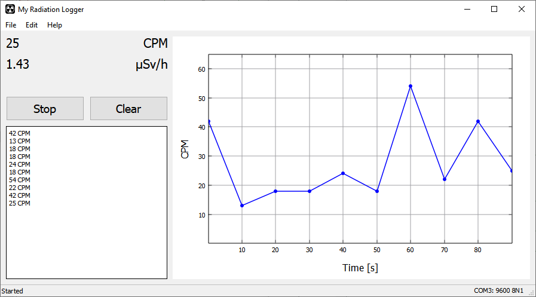
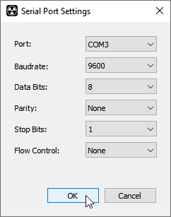

# My Radiation Logger

My Radiation Logger is an open source software to log and display CPM and doserate data from the [My Electronics Geiger Counter Shield](http://my-electronics.net/geiger-counter-shield) written in Qt/C++:

	

It uses the [My Plot](http://github.com/my-electronics/My-Plot) widget for plotting and has no further dependencies on any external libaries.

The software can record CPM data in realtime, save logfiles as well as display logfiles from the SD card logger. My Radiation Logger has been tested on Windows, MacOS and Linux.

My Radiation Logger is easy to set up and use: Connect your Arduino with the Geiger Counter Shield as usual and run My Radiation Logger. 
Navigate to "Edit > Serial Port..." and select the COM port of your Arduino and click OK: 

The default settings of the Geiger Counter Shield are 9600 8N1. My Radiation Logger is now ready to use. To start click "Start". 

The conversion factor of the Geiger Tube can be changed with "Edit > Geiger Tube..." 